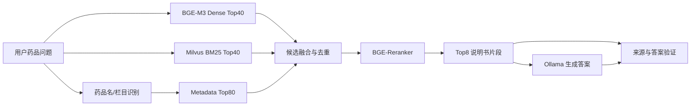

# 药品说明书 RAG 智能问答系统项目总结

## 项目概述

这是一个面向药品说明书检索与中文问答的本地化 RAG 系统。系统将药品说明书 Excel、PDF、TXT、CSV 等文件解析为带栏目和药品元数据的文本片段，写入 Milvus 稠密/稀疏混合索引；用户提问后，系统执行药品名与栏目预过滤、BGE-M3 语义检索、Milvus 原生 BM25 检索、BGE-Reranker 重排，再由 Ollama 本地模型生成回答。

系统最终返回回答、Top 来源片段、检索分数、置信度、来源支持度和验证等级，适合药品说明书的适应症、用法用量、禁忌、不良反应和相互作用等可追溯问答场景。

## 技术栈

- 后端：FastAPI、Uvicorn、Pydantic
- 前端：Vue 3、Vite、Lucide
- 向量模型：BGE-M3
- 重排模型：BGE-Reranker-Base
- 本地大模型：Ollama / `qwen3.5:4b`
- 向量数据库：Milvus 2.6
- 缓存：Redis
- 文档处理：pandas、openpyxl、pdfplumber、PyPDF2
- 部署：Docker Compose、MinIO、etcd
- 推理加速：PyTorch、CUDA、FP16

## 数据处理流程

### 1. 原始数据

- 原始数据目录：`data/`
- 主要文件：`药品说明书数据库_医药数据查询(1).xlsx` 至 `(7).xlsx`
- 文件数量：`7` 个 Excel 文件
- 文件体积：约 `462.2 MiB`
- 导入对象：药品说明书表格记录；项目导入统计约 `11.4 万` 条记录
- 当前本地片段库：`data/documents.jsonl`，约 `1.58 GB`

> 说明：一条说明书会按栏目和长度拆成多个片段，因此原始记录数、JSONL 行数和 Milvus 向量数不是同一个口径。

### 2. Excel 清洗与格式识别

Excel 解析逻辑在 `api/main.py`，批量导入脚本在 `scripts/import_excel_large.py`。

- 使用 pandas 按工作表读取 Excel，统一以字符串读取，避免药品批准文号、剂量等字段被自动转换。
- 对单元格做空值清理、列名标准化和空行/空列过滤。
- 自动区分两类工作表：
  - `table_row`：每一行对应一条药品说明书记录。
  - `key_value_sheet`：首列为“字段名”，后续列为“字段值”的键值结构。
- 对大文件采用行级迭代和批量写入，避免通过 Web 上传处理全量 Excel 时触发超时；默认每批处理 `256` 个片段。

### 3. 元数据构建

每条药品记录会抽取并保留以下元数据：

- `drug_name`：药品名称
- `generic_name`：通用名
- `trade_name`：商品名
- `approval_number`：批准文号
- `manufacturer`：生产企业
- `drug_category`、`drug_property`、`related_disease`
- `source_file`、`sheet_name`、`row_number`、`source_url`
- `record_type`、`section_name`、`field_name`、`chunk_index`

这些字段同时用于结果展示、药品名消歧、栏目匹配和候选去重。

### 4. 结构化切分

普通文本按段落和标点切分；Excel 说明书不直接把整行拼成一个长文本，而是根据栏目别名进行分组。当前支持的核心栏目包括：

- 成份、性状、适应症
- 用法用量、禁忌、不良反应、注意事项
- 孕妇及哺乳期妇女用药、儿童用药、老年用药
- 药物相互作用、药理毒理、药代动力学
- 贮藏、包装、有效期

每个栏目片段都会补充“药品名称”和“栏目”头信息，使单独被召回时仍保留语义上下文。Excel 栏目片段的默认配置为：

- 最大长度：`520` 个字符
- 相邻片段重叠：`80` 个字符
- 每条记录的片段数：默认不截断

### 5. 当前入库结果

从运行中的 `/api/v1/stats` 查询可得到：

- Milvus Collection：`pharmaceutical_docs`
- 当前在线索引片段：`1,272,712`
- 稠密向量维度：`1024`
- 本地文档存储：`data/documents.jsonl`

## Milvus 索引设计

Milvus Collection 的创建逻辑在 `utils/database.py`。

### 1. 数据字段

- `id`：INT64 主键，自增
- `drug_name`：VARCHAR
- `text`：VARCHAR，开启文本分析器
- `language`：VARCHAR
- `embedding`：1024 维 FLOAT_VECTOR
- `sparse`：SPARSE_FLOAT_VECTOR
- `metadata`：JSON 序列化后的 VARCHAR

### 2. 稠密索引

- Embedding 模型：BGE-M3
- 相似度：Inner Product
- 索引类型：`IVF_FLAT`
- 参数：`nlist=1024`
- 查询参数：`nprobe=10`

### 3. 原生稀疏 BM25 索引

系统使用 Milvus `FunctionType.BM25` 直接从 `text` 字段生成稀疏向量：

- 输入字段：`text`
- 输出字段：`sparse`
- 索引类型：`AUTOINDEX`
- 检索度量：`BM25`

因此稠密向量、BM25 稀疏向量和原文保存在同一个 Collection 内，不需要维护独立的本地 BM25 索引，也避免了“文本库更新但 BM25 索引未同步”的问题。

## 检索方案

检索主逻辑位于 `retrieval/hybrid_retriever.py`。

### 1. 查询预处理

`MetadataFilter` 会从问题中尝试识别：

- 药品名、通用名、商品名、批准文号
- 生产企业、疾病、标题
- 说明书栏目意图，例如“禁忌”“怎么吃”“不良反应”“相互作用”等

命中药品名和栏目时，系统会生成元数据候选，并对栏目匹配的片段增加分数。

### 2. 混合召回

对同一个问题执行三类候选获取：

- 元数据候选：最多 `80` 条
- BGE-M3 稠密向量召回：Top `40`
- Milvus 原生稀疏 BM25 召回：Top `40`

稠密召回负责语义相似问题，BM25 负责药品名、剂量、批准文号和栏目等强关键词。两类结果互补，避免只依赖向量相似度时被近似药名或相似疾病描述带偏。

### 3. 融合、去重与重排

候选融合过程如下：

- 以 `source_file + sheet_name + row_number + section_name/field_name + chunk_index` 组成去重键。
- 对稠密、稀疏和元数据候选按排名叠加混合分数。
- 先按混合分数做粗排，保留至少 `Top24` 候选。
- 使用 BGE-Reranker-Base 对 query-片段对进行精排。
- 最终输出 Top `8` 个来源片段给生成模型。

Reranker 将粗排分数与交叉编码器相关度合并，默认重排权重为 `0.35`。



### 4. Redis 检索缓存

缓存键由以下内容组成：

- 用户问题
- Milvus Collection 名称
- TopK、Dense TopK、BM25 TopK
- 是否启用重排及重排模型名称

缓存前缀为 `retrieval:`，默认过期时间为 `3600` 秒。重新入库后会清理该前缀下的检索缓存。

## 回答生成与验证

### 1. 本地回答生成

生成逻辑在 `generation/answer_generator.py`：

- 通过 Ollama 调用本地模型 `qwen3.5:4b`
- 温度：`0.1`
- 最大生成长度：`1024`
- 超时：`120` 秒
- 不开启思维链输出：`think=false`

Prompt 的关键约束：

- 必须使用中文回答。
- 只能依据检索到的说明书片段，不补充上下文以外的医学知识。
- 资料不足时明确说明“未找到相关信息”。
- 涉及剂量、用法、禁忌和不良反应时采用保守表达。
- 输出来源引用，并提醒用户遵循医生或药师指导。

### 2. 答案后验证

`generation/answer_verifier.py` 对回答进行来源支持度估计：

- 按句切分回答，排除固定的来源和用药提醒语。
- 对每个句子计算与来源片段的关键词/中文二元组重合度。
- 句子支持分低于 `0.18` 时记为未支持句。
- 平均支持度达到 `0.30` 且未支持句不过半时，标记为已验证。
- 根据支持度输出 `high`、`medium`、`review`、`low`、`none` 五档验证等级。

前端会展示置信度、来源支持率、验证提示、Top 来源片段和响应时间，方便用户回查原始说明书内容。

## 模型加载与 GPU 推理

### 1. BGE-M3

`vectorization/embedding_service.py` 用于入库，`retrieval/hybrid_retriever.py` 用于查询。

- 自动检测 CUDA；可用时使用 GPU。
- 启用 FP16，降低显存占用。
- 入库编码批大小：默认 `32`。
- BGE-M3 最大序列长度：`512`。

### 2. BGE-Reranker

`retrieval/reranker.py` 加载 BGE-Reranker-Base：

- 自动选择 CUDA 或 CPU。
- CUDA 下启用 FP16。
- 对候选文本最多截取 `1800` 字符参与重排。

## 前后端入口

### 1. 后端

- 主入口：`api/main.py`
- 健康检查：`GET /health`
- 系统状态：`GET /api/v1/stats`
- 问答接口：`POST /api/v1/qa/ask`
- 文件上传：`POST /api/v1/documents/upload`
- 批量向量化：`POST /api/v1/documents/vectorize`

后端状态接口直接读取 Milvus 实体数，不再读取完整的本地 JSONL 文件，避免 100 万级片段库下的页面状态请求阻塞。

### 2. 前端

前端位于 `frontend/`，使用 Vue 3 + Vite 实现药品说明书问答工作台，页面包含：

- 后端地址与连接状态
- Milvus 索引片段数、模型和检索链路状态
- PDF / Excel / TXT / CSV 文件导入
- 常用药品问题快捷提问
- 问答对话、置信度和响应时间
- 来源片段、栏目、相关度和验证结果

### 3. Docker 基础服务

`docker-compose.yml` 编排以下服务：

- Milvus：`19530`
- Redis：`6379`
- MinIO：`9000` / `9001`
- etcd：Milvus 元数据服务

## 项目亮点

- 将药品说明书表格从“整行文本入库”改为“药品名 + 语义栏目 + 长文本分段”入库，提升片段自身语义完整性和来源可追溯性。
- 使用 Milvus 原生稀疏 BM25 与 BGE-M3 稠密向量共存于一个 Collection，降低双索引维护成本。
- 使用“元数据候选 + Dense Top40 + Sparse Top40 + 去重融合 + Reranker Top8”的分层检索链路，兼顾药品名精确匹配和问题语义理解。
- 在生成后增加句子级来源支持度评估，而不仅仅返回大模型答案；前端可直接查看来源和验证等级。
- 采用本地 Ollama、Milvus、Redis、Docker Compose 和 CUDA/FP16，完成不依赖云端 API 的端到端部署。

## 可直接用于汇报的项目描述

我完成了一个本地化药品说明书 RAG 问答系统。数据层面，我对 7 个药品说明书 Excel 文件进行工作表识别、行级清洗、药品元数据抽取和栏目级切分，将药品名、适应症、用法用量、禁忌、不良反应等字段拆分为可追溯片段；索引层面，我使用 BGE-M3 生成 1024 维向量，并在 Milvus 中同时建立 IVF_FLAT 稠密索引和原生 BM25 稀疏索引，当前知识库包含 127.27 万个索引片段；检索层面，我实现了元数据过滤、Dense Top40、BM25 Top40、候选去重融合和 BGE-Reranker Top8 的混合链路；生成层面，我接入 Ollama 本地模型，并用来源片段和句子级支持度校验约束回答。最后通过 FastAPI、Vue 3 和 Docker Compose 搭建了支持文件导入、问答、来源核验和系统监控的本地工作台。

## 启动

```powershell
cd D:\PycharmProjects\Pharmaceutical-Catalog_RAG-main
docker compose up -d
```

```powershell
cd D:\PycharmProjects\Pharmaceutical-Catalog_RAG-main
.\.venv\Scripts\python.exe -m uvicorn api.main:app --host 127.0.0.1 --port 8001
```

```powershell
cd D:\PycharmProjects\Pharmaceutical-Catalog_RAG-main\frontend
npm run dev
```

前端页面中的 API 地址设置为：

```text
http://127.0.0.1:8001
```
